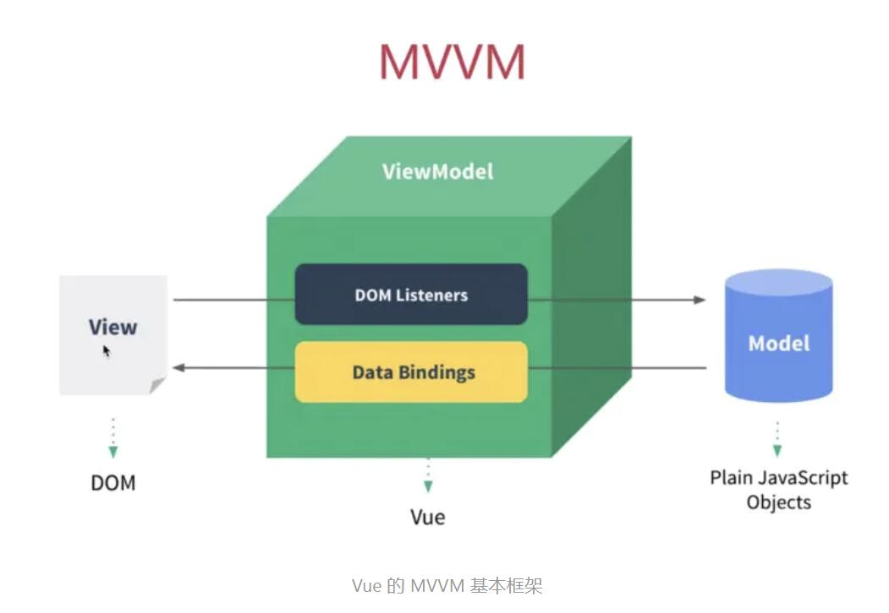
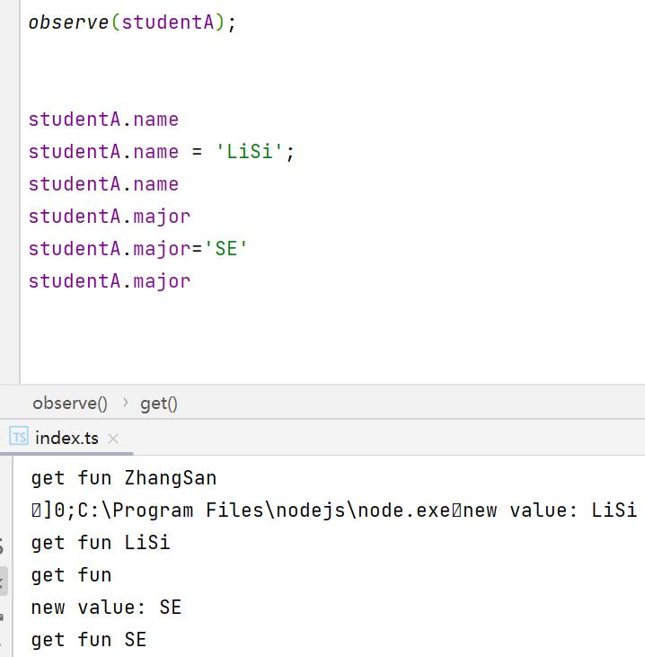
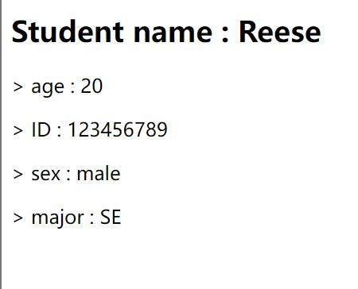
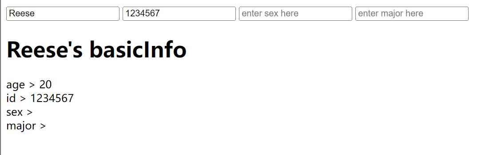
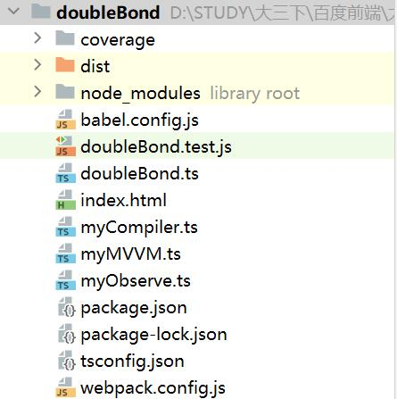
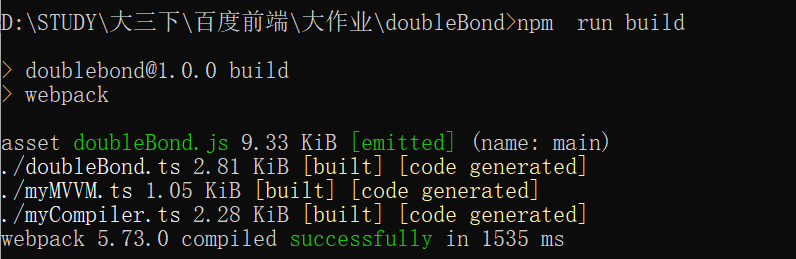
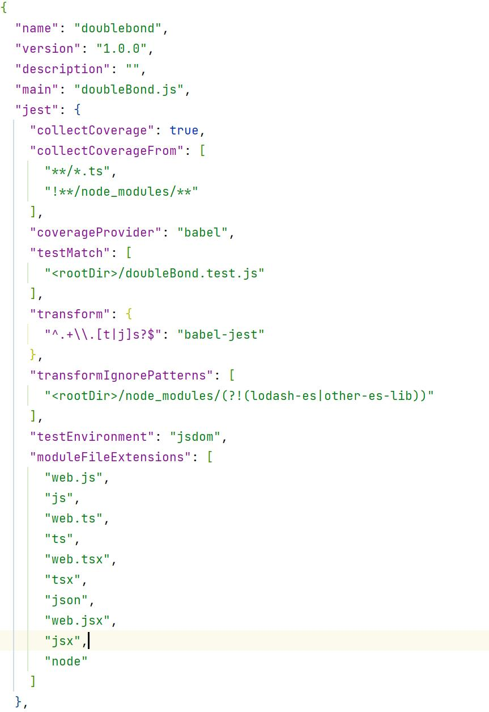
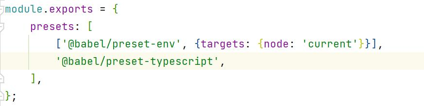
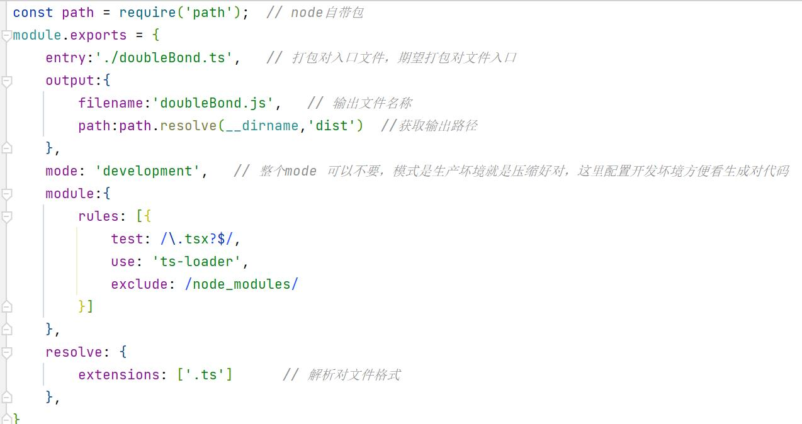
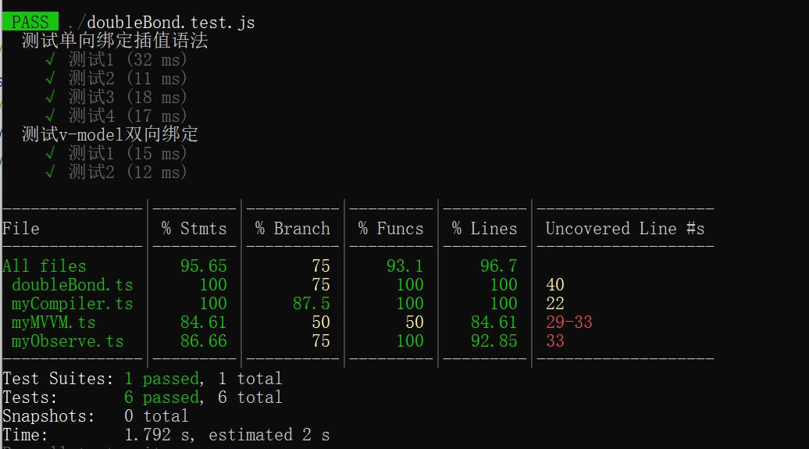

# 结课作业提交仓库

# 百度前端作业方向二——简单的MVVM框架

姓名：周化宇
学校：南京大学
专业：软件工程
年级：大三
QQ：1206109134

[TOC]

**注意：**最后完整作业的项目文件在 `doubleBond`文件夹中，已经使用webpack打包并编译，打开index.html可以直接看到效果

## 0. 概念设计

MVVM 框架的全称是 Model-View-ViewModel,它是 MVC（Model-View-Controller）的变种。

要想实现MVVM，就要实现数据、试图分离，并且将DOM操作封装，这样开发者只需要操作数据，不需要手动操作DOM元素。



VUE官网可以查询到的VUE搭建的MVVM框架如上。要想实现MVVM，关键在于ViewModel中的DOM Listeners和Data Bindings。它们的作用分别是观察View，并将View上的用户造成的数据改变拦截然后同步给Model；以及在Model中数据更改时，将与该数据绑定的DOM元素进行同步改变。

为了更好的实现MVVM框架，我将项目拆分成几个模块，分为不同迭代增量完成项目。

## 1. 实现数据劫持

### 1.1 Object.defineProperty

实现数据劫持可以用到一个Object对象的方法：`Object.defineProperty`,这个方法也是VUE数据双向绑定原理的常见面试题。

`defineProperty`接受三个参数：

1. 监控的、或是需要修改的对象
2. 对象属性的名称
3. 描述符对象。其中描述符对象又包括：
   1. configurable:表示能否通过delete删除属性从而重新定义属性，能否修改属性的特性，或者能否把属性修改为访问器属性，默认值为true。
   2. enumerable：表示能否通过for in循环访问属性，默认值为true
   3. writable：表示能否修改属性的值。默认值为true。
   4. value：包含这个属性的数据值。默认值为undefined

从上面的方法参数也可以看到，调用一次`defineProperty`方法只能劫持一个对象的一个属性，如果要对其所有属性进行劫持，则需要使用循环遍历对象中的属性。

除了以上几个参数外，`defineProperty`还有两个函数，分别是：

1. get：在读取属性时调用的函数，默认值是undefined
2. set：在写入属性的时候调用的函数，默认值是undefined

### 1.2 实现一个数据的”观察者“

根据以上信息，我们可以写出一个简单的用于劫持一个对象全部属性的数据劫持函数：

```typescript
function observe(data: object) {
    if(!data|| typeof data !== 'object') return ;
    for(let key in data) {
        //循环遍历对象的所有属性
        let val:any = data[key as keyof object];
        Object.defineProperty(data, key,{
            enumerable: true,
            configurable: true,
            get:function() {
                //读取时调用
                console.log('get fun '+val);
                return val;
            },
            set:function(newVal:any) {
                //写入时调用
                console.log('new value: '+newVal);
                val = newVal;
            }
        });
        if(typeof val === 'object') {
            observe(val);
        }
    }
}
```

这样一个函数可以在后续的MVVM框架中，承担一个”观察者“的角色。在Model中对象的属性发生改变时，该观察者的set函数就会被触发，并将改动的值”劫持“下来，同步更新到View中。

### 1.3 效果

为了测试 `observe`方法的效果，我新建了一个对象实例，并属于了一些实验用的对象属性及其值

```typescript
interface studentInfo {
    name: string
    age: number
    major:string
    sex:string
    id:number
}

let studentA:studentInfo = {
    name: 'ZhangSan',
    age: 22,
    major:'',
    sex: 'male',
    id: 123456789,
}

observe(studentA);
```

结果如下：



可以看到，学生信息对象中原本的姓名值为”ZhangSan“，在调用 `observe（studentA）`方法后，`studentA`对象的属性就都被”观察“了起来。

当调用`studentA.name`时，get函数被触发，在控制台中打印出相应的字符串

同理，在给`studentA.name`赋值时，set函数被触发，在控制台中打印出相应的字符串


## 2.实现发布订阅模式

数据劫持的根本目的并不是将数据打印在控制台里，我们需要通过刚才的函数，将数据变化通知到View，也就是视图上，这就需要用到发布订阅模式。其中，发布者就是Model中的数据，订阅数据变化的订阅者时View，并且View在收到数据变化时也要改变自己的仕途。

### 2.1 实现发布者

发布者作为被观察的主体，需要可以发布消息，还需要可以增加订阅者到一个列表中，即持有所有订阅了自己的观察者对象。每次发布消息时，发布者都要将消息通知到列表中的每个订阅者。

```typescript
class Subject {
    observers:Observer[]
    constructor(){
        this.observers = [];
    }

    addObserver(observer:Observer) {
    //添加观察者，即订阅者
        this.observers.push(observer);
    }

    notify(msg:string){
    //发布消息
        for(let observer in this.observers){
            this.observers[observer].update(msg)
        }
    }
};
```

### 2.2 实现订阅者

订阅者是观察数据变化的对象，它需要能够订阅观察目标Subject，还需要将订阅到的数据同步到View中

```typescript
class Observer {
    name:string
    constructor(name: string) {
        this.name = name;
    }
    update(msg: string){
        //将数据变化体现在View中
        console.log(this.name + ' updated:' + msg);
    }
    subscribe(subject:Subject) {
        //订阅发布者
        subject.addObserver(this);
    }
}
```

### 2.3 效果

使用以下代码测试效果

```typescript
var Reese = new Observer('Reese');
var Tom = new Observer('Tom');
var sub = new Subject();
Reese.subscribe(sub);
Tom.subscribe(sub);
sub.notify('version 0.1');
```

效果如下：


可以看到，订阅对象 `Reese`和 `Tom`都受到了数据更新，并打印在了控制台上


## 3. 数据的绑定

有了数据劫持和发布订阅模式的基础，现在我们需要实现真正的数据单向绑定和双向绑定。

首先要做的就是真正实现数据劫持和发布订阅模式中对Model和View的数据变更，而不只是打印在控制台上

### 3.1 单向绑定

这里我借用了VUE中的语法，使用文本插值的方法进行数据绑定

```HTML
...
<div id="app" ><h2>Student name : {{name}}</h2></div>
<div id="basicInfo">
    <p>> age : {{age}}</p>
    <p>> ID : {{id}}</p>
    <p>> sex : {{sex}}</p>
    <p>> major : {{major}}</p>
    </div>
<script type="text/javascript" src="bond.js"></script>
...
```

#### 3.1.1 MVVM类

要想将Model中的数据和View绑定，就需要我们的代码能够分析DOM节点、识别这些文本插值语法，并将DOM中的这些值与数据源Model中的数据关联起来。

这里我仿照VUE的写法，将功能都封装在一个入口类中，使用时只需要实例化这个类并写入数据即可，不需要手动调用其他方法。

```typescript
class MVVM {
    data: object;
    node: string;
    observers: Observer[];
    constructor(opts:any) {
        //构造函数
        ......
    }

    compile(node:any) {
        //分析DOM节点
        if(node.nodeType === 1) {
            node.childNodes.forEach((childNode: any) => {
                this.compile(childNode);
            });
        }else if(node.nodeType === 3) {
            this.renderText(node); // 已解析到文字
        }
    }

    renderText(node:any) {
        //解析文本，识别插值表达式
        console.log('running MVVM renderText');
        let reg = /{{(.+?)}}/g;
        let match;
        while(match = reg.exec(node.nodeValue)) {
            ......
            new Observer(this, key, function(newVal:any, oldVal:any) {
                node.nodeValue = node.nodeValue.replace(oldVal, newVal);
            });
        }
    }
}
```

这里为了精简展示，我省略了一些具体的实现步骤，但是MVVM类的大体框架即如上。

使用时是需要`let demo=new MVVM（{node:'',data:{}}）`并向Model写入数据即可，其他函数都将由MVVM类调用

在构造函数里，我调用了第一步中实现的数据劫持方法——`observe`，将Model中的数据，也就是实例中`data：{}`中的数据进行了劫持。

接下来，调用`compile`方法对DOM节点进行递归解析，直到某子节点的类型为文本为止。

此时，将具有文本信息的子节点交由 `renderText`方法，该方法将使用正则表达式识别插值表达式，并将插值表达式替换为Model中真正的值。最后，该方法将给该DOM节点创建并绑定一个新的观察者，该新观察者将观察其插值表达式中对象属性所对应的对象主体。

#### 3.1.2 Observer类

```typescript
class Observer {
    subjects: any;
    vm: MVVM;
    key: string;
    callback: Function;
    val: string;
    constructor(vm:MVVM, key:string, callback:Function) {
        //构造函数
        ......
    }

    update() {
        //通过回调函数更新数据
        var oldVal = this.val;
        var newVal = this.getVal();
        if(oldVal !== newVal) {
            this.val = newVal;
            this.callback.bind(this.vm)(newVal, oldVal);
        }
    }

    getVal() {
        //获取属性值
        currentObs = this;//所有的观察者都由observe方法观察，这里需要将observe的观察主体切换为当前观察者
        let val = this.vm.data[this.key as keyof object];//将触发defineProperty的get函数
        currentObs = null;
        return val;
    }

    subscribeTo(subj:Subject) {
        //订阅
        ......
}
```

这里为了精简展示，我省略了一些具体的实现步骤，但是Observer类的大体框架即如上。

一个Observer类的对象实例对应View中一个插值表达式对应的值。该类可以通过数据劫持，触发defineProperty中的get函数获取Model中的值，并将其更新到View中（`update()`方法）

`Subject`类和`observe()`方法与之前展示的相同

#### 3.1.3 效果

创建测试用的MVVM实例

```typescript
let demoMVVM = new MVVM({
    node: '#app',
    data: {
        name: 'Reese',
    }
});

let basciInfo = new MVVM({
    node: '#basicInfo',
    data: {
        age: 20,
        sex: 'male',
        major: 'SE',
        id: 123456789,
    }
});
```

编译为.js后打开HTML，效果如下：



### 3.2 双向绑定（完整项目）

实现双向绑定后便实现了一个较为完整的简易MVVM框架，在单向绑定的基础上，我们需要能够解析HTML DOM中的属性（如v-model, v-on）等等，并且通过这些指令实现相应的功能，比如将View上的数据变化更新到Model，并将行为与数据变化绑定起来。

因此，我将compile方法从MVVM中独立出来，形成Compile类，该类主要负责处理：遍历DOM的节点直到找到文本内容、识别文本内容中的指令（包括插值表达式、v-model和v-on）、执行这些指令

#### 3.2.1 Compile类

```typescript
class Compile {
    vm: MVVM;
    node:any;
    constructor(vm:MVVM) {
        //构造函数
    }

    compile() {
        this.traverse(this.node);
    }

    traverse(node:any) {
        //递归判断节点类型
        ...
    }

    // 处理指令
    compileNode(node:any) {
        let attrsArr = Array.from(node.attributes);
        attrsArr.forEach((attr:any) => {
            if(this.isModel(attr.name)) {
                this.bindModel(node, attr);
            }else if(this.isHandle(attr.name)) {
                this.bindHandle(node, attr);
            }
        });
    }

    bindModel(node:any, attr:any) {
    //处理v-model
        ...
        node.addEventListener('oninput',(e:any) => {
           this.vm.data[key] = e.target.value;
        })
    }

    bindHandle(node:any, attr:any) {
    //处理v-on
        ...
    }

    // 判断指令
    isModel(attrName:string) {
        return (attrName === 'v-model');
    }

    isHandle(attrName:string) {
        return (attrName.indexOf('v-on') > -1);
    }

    renderText(node:any) {
    //处理插值表达式
       ...
    }

}
```

这里为了精简展示，我省略了一些具体的实现步骤，但是Compile类的大体框架即如上。

其实现逻辑是解析出指令后，执行指令所对应的功能，不管是获取数据还是更改数据，都是依赖于之前实现的Observer类、observe方法，也就是发布订阅模式以及defineProperty中的get()方法和set()方法。

需要注意的是，在处理v-model的时候，我使用了eventListener来相应用户的输入行为，如果用户在输入框中进行输入（更改View中的数据），输入的值将会被通过发布订阅模式传递给Model

其他类的方法大体不变。

#### 3.2.2 效果

创建测试用的MVVM实例

```typescript
let testMvvm = new MVVM({
    node:"#app",
    data: {
        name: 'Reese',
        age: 20,
        sex: '',
        major: '',
        id: 1234567,
    },
    methods: {
        hello: function() {
            alert('welcome!');
        }
    }
});
```

```HTML
<div id="app">
    <input v-model="name" v-on:click="hello" type="text">
    <input v-model="id" type="text" placeholder="enter student id here">
    <input v-model="sex" type="text" placeholder="enter sex here">
    <input v-model="major" type="text" placeholder="enter major here">
    <h1>{{name}}'s basicInfo</h1>
    age > <span>{{age}} </span><br>
    id > <span>{{id}}</span><br>
    sex > <span>{{sex}}</span><br>
    major > <span>{{major}}</span>
</div>
<script type="text/javascript" src="./dist/doubleBond.js">
```



在输入框中输入数值

![双向绑定效果2]pics\双向绑定效果2.jpg)


## 4. 最终项目结构（doubleBond）



其中doubleBond.ts中是`Subject`类和`Observer`类

```typescript
export class Subject {
    id:number;
    observers:Observer[];
    constructor() {
    ...
    }

    addObserver(observer:Observer):void {
    ...
    }

    notify() {
    ...
    }
}
```

`myCompiler.ts`中是`Compile`类，`myObserve.ts`中是`observe()`方法，`myMVVM.ts`是我的入口类`MVVM`，`index.html`是展示用的HTML文件，编译生成的js项目文件在`dist`文件夹中，其余为webpack配置文件

随后在每个ts文件中对需要暴露的类进行export，并在需要用到该类的ts文件中import该类。

为了方便测试，将项目进行webpack打包



## 5. 单元测试

### 5.1 环境配置

我使用jest进行单元测试，为项目配置了jest、Babel、jsdom环境等测试所需要的环境

部分配置文件如下：

**package.json部分：**



**babel.config.js**：



**webpack.config.js：**



### 5.2 单元测试

#### 5.2.1 注意事项

进行测试前请先将 `doubleBond.ts`文件末尾调试用的MVVM实例删除或注释掉


并且务必将 `myMVVM.ts`文件中的 `init()`方法中的

```typescript
this.node = document.querySelector(opts.node);
```

替换为以下代码：

```typescript
this.node= opts.node
```


如图，需要将上面一行代码注释掉，替换为下面这一行代码

原因是，原来的代码是为了可以直观的在浏览器看到效果，方便调试。若想要运行jest测试，则需要进行如上调整

#### 5.2.2 测试内容

`npm run test`指令开始测试

在项目根目录下创建`doubleBond.test.js`测试文件

文件部分内容如下：

```typescript
import {MVVM} from "./myMVVM";

describe("测试单向绑定插值语法", function () {
    test("测试1",function () {
        let testNode=document.createElement("div");
        testNode.setAttribute("id", "app")
        testNode.textContent = "{{name}}";
        let testMvvm = new MVVM({
            node:testNode,
            data: {
                name: 'Reese',
                age: 20,
                sex: 'male',
                major: '',
                id: 123456789,
            },
            methods: {
                hello: function() {
                    alert('welcome!');
                }
            }
        });
        expect(testNode.textContent).toBe("Reese")
    });
}
```

```typescript
describe("测试v-model双向绑定",function (){
    test("测试1",function (){
        let testNode=document.createElement("div");
        testNode.setAttribute("id", "app");

        let inputBox=document.createElement('input')
        inputBox.setAttribute('v-model','name')
        inputBox.setAttribute('type','text')
        inputBox.setAttribute('v-on:click','hello')
        testNode.appendChild(inputBox)

        let subNode=document.createElement('h1')
        subNode.textContent="{{name}}"
        testNode.appendChild(subNode)
        let testMvvm = new MVVM({
            node:testNode,
            data: {
                name: 'Reese',
                age: 20,
                sex: 'male',
                major: '',
                id: 123456789,
            },
            methods: {
                hello: function() {
                    alert('welcome!');
                }
            }
        });
        inputBox.value='Tom'
        inputBox.dispatchEvent(new Event('oninput'))
        expect(testMvvm.data.name).toBe("Tom")
    })
}
```

我一共设计了6个测试用例，尽可能地覆盖到`MVVM`、`Compile`、`Observer`、`Subject`几个类中的所有分支和方法

测试结果如下：



6个用例全部通过，总语句覆盖率95.65%，功能覆盖率93.1%